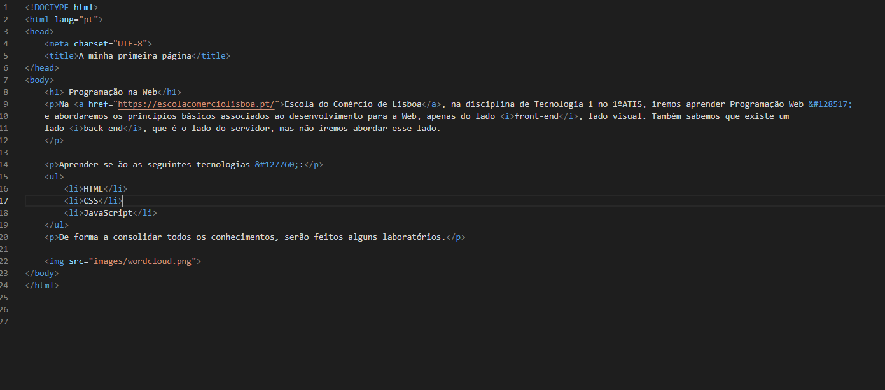
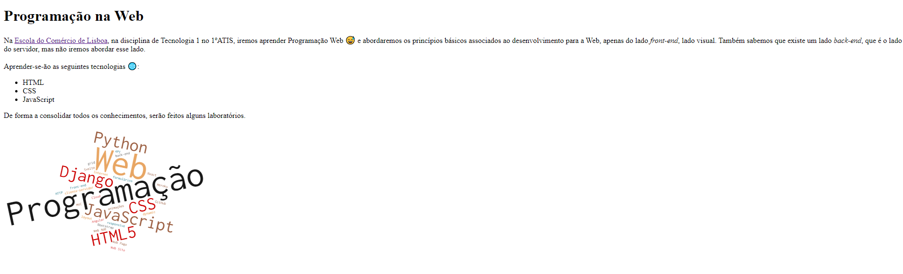
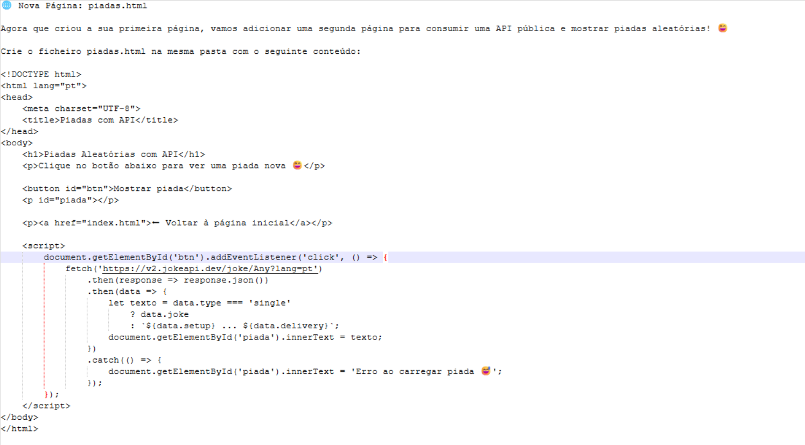

**Escola do Comércio de Lisboa**

# Programação Web - Aula 1: <br>*A minha primeira página Web*

**OBJECTIVO**: Neste laboratório nº1:
* criará uma primeira página na Web.
  
**PRÉ-REQUISITOS**: Instale o Visual Studio Code (VsCode), IDE que utilizaremos nesta disciplina, para editar o código HTML de forma fácil. Há outros IDEs, mas usaremos este &#128513;

## Criação de uma página Web
* Crie uma pasta Lab1. 
* Abra a pasta com o VsCode
* Dentro dessa pasta, crie o ficheiro `index.html` com o seguinte código fonte HTML;




O HTML é uma linguagem de marcação para construir páginas Web. OS ficheiros HTML possuem marcadores (*tags*), palavras entre parênteses angulares (`<` e `>`) que são comandos de formação da linguagem. 

No elemento `<title>Primeira página</title>`:
* `<title>` é o marcador de abertura
* `</title>` é o marcador de fecho
* `Primeira página` será o conteúdo afetado pelo marcador <title>, que neste caso especificará o título da barra de navegação.

No ficheiro em cima poderá ver a utilização de vários marcadores:
* `h1` = marcador que define um titulo - heading1 (`h2` um subtítulo, `h3` um subsubtítulo, ...)
* `p` = marcador que define um parágrafo
* `ul` = marcador que define uma lista não numerada (`ol` para lista numerada)
* `li` = marcador que define uma linha
* `img` = marcador que define uma imagem
* `a` = marcador de âncora para hiperlink, especificado como valor do atributo `href` 

Dentro de um marcador podem ser especificados pares de atributo = valor. Os atributos modificam os resultados padrões dos elementos e os valores caracterizam essa mudança. Existem neste ficheiro os seguintes atributos:
* `src` = atributo que define o nome do ficheiro com a imagem
* `href`= atributo que define o URL da hiperligação
Nas próximas aulas falaremos mais em detalhe destes aspectos.

Crie, na pasta `lab1`, a pasta `images`, e guarde dentro desta a imagem  `wordcloud.png` em baixo. 


Uma vez editado, abra o ficheiro `index.html` com um Browser para ver se visualiza corretamente a sua página, tal e qual, como se apresenta em baixo.



**Clique nas imagens em cima se quiser ver em maior &#129488;**

## Criacao de repositorio GitHub
* Crie a sua conta GitHub (https://github.com/). Pode usar as credenciais da Escola (e-mail).
* Crie, na sua conta GitHub (https://github.com/), o repositório `lab1`. Vamos abri-lo agora..
* Abra uma janela de comandos/terminal (vamos usar o terminal do VsCode).
* Na pasta lab1 execute os seguintes comandos (# indica início de um comentário, que não deverá escrever):
```bash
> git init  # cria repositório git
> git add *   #indica ao git para rastrear todos os ficheiros
> git commit -m "Primeira pagina"   # guarda mudanças no git
> git branch –M main # ficamos apenas com um branch (principal-main)
> git remote add origin https://github.com/<username>/lab1 # Adiciona o endereco do repo do git
> git push -u origin main # carrega e atualiza repo do GitHub
```
Verifique que os dados estão no GitHub.

# Fim
Parabéns por ter chegado ao fim! Esperamos que tenha gostado de ter feito a sua primeira página Web &#127760;!

# Part II



# Part III

* Faz uma página exclusiva com informação máximo que encotrares sobre REST API e Integração com Java. Podes colocar exemplos práticos de uso como fizemos no exemplo em cima (part II).
* Em resumo, será uma página orientada a pesquisa e exemplos práticos para melhor compreensão desta matéria.

* Nota: Deve ser acedido através da página inicial, usando CSS (styles.css) com o nome: rest-api.html.

# Bom trabalho &#127760;


